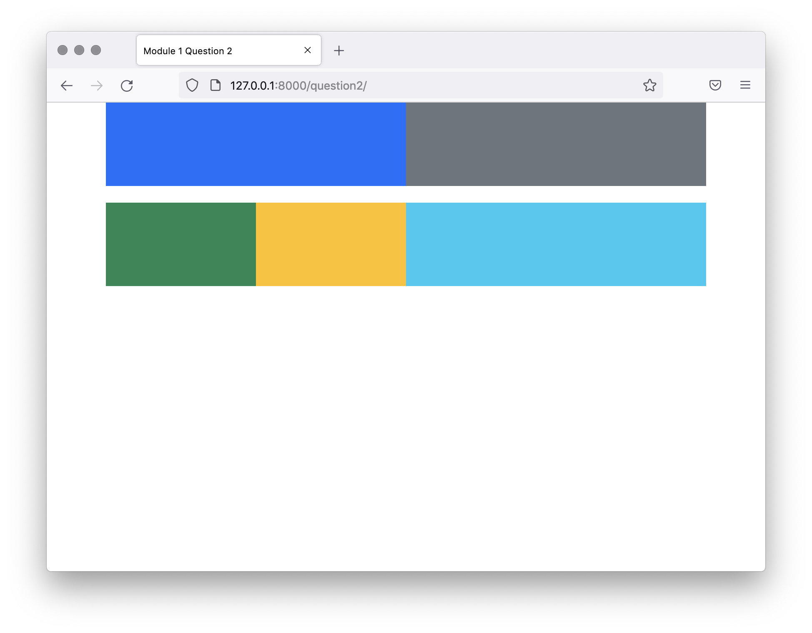

# Create a Blog: Question 2
Question 2

This will be a test of your knowledge of the Bootstrap column system. The URL /question2/ has been configured to call the view question2, which renders the template question2.html. This template has been configured with a container div.

Inside of this div you’ll need to add two rows.

- The first row should have two columns. Each of these two columns should take a 50% of the container width at medium breakpoints or above. Below this breakpoint, they should take up 100% width.
- The second row should have three columns. At medium breakpoint and above, the columns should take up 25%, 25% and 50%. Below the medium breakpoint, the columns should take up 50%, 50% and 100%.

You can also add the Bootstrap background color classes to help visualize the columns, using them will not affect the assessment. They are:
`bg-primary, bg-secondary, bg-success, bg-danger, bg-warning, bg-info, bg-light` and `bg-dark `

Here’s what the columns should look like at medium or large




And at small sizes. Resize the screen to see the rows and columns change.


## Solution

```html
<div class="container" id="question-2-container">
    
        Question 2:
        Add your rows and columns inside this div. They are already sized at 100px height.
        Use these classes to color your columns to help see them.
        bg-primary, bg-secondary, bg-success, bg-danger, bg-warning, bg-info, bg-light and bg-dark
        Setting color classes doesn't affect the scoring of your answer.
    
    <div class="row">
        <div class="col-md-6 col-12 bg-primary"></div>
        <div class="col-md-6 col-12 bg-secondary"></div>
    </div>
    <div class="row">
        <div class="col-md-3 col-6 bg-success"></div>
        <div class="col-md-3 col-6 bg-warning"></div>
        <div class="col-md-6 col-12 bg-info"></div>
    </div>
</div>
```

- Make a div and set its class to "row".
    - Inside this div, make two more divs.
    - Set their classes to "col-md-3 col-12".
    - Use any colors you like for these divs.

- Make another div with the class "row".
    - Inside this div, make three divs.
    - The first two should have their class set to "col-md-3 col-6".
    - The third div should have the class "col-md-6 col-12".
    - Use any colors you like for these divs.


## Explanation:

1. **First Row**:
- The first row contains two columns, each taking up **50%** of the container width on medium and larger screens (`col-md-6`), and **100%** width on smaller screens (`col-12`).
- The first column has the class `bg-primary` for a blue background.
- The second column has the class `bg-secondary` for a gray background.


2. **Second Row**:
- The second row contains three columns.
- The first and second columns each take up 50% of the container width on smaller screens (`col-6`) and 25% on medium and larger screens (`col-md-3`).
- The third column takes up 100% of the container width on smaller screens (`col-12`) and 50% on medium and larger screens (col-md-6).
- The first column has the class `bg-success` for a green background.
- The second column has the class`bg-warning` for a yellow background.
- The third column has the class `bg-info` for a light blue background.

This will ensure the layout adapts as required when the screen size changes.


