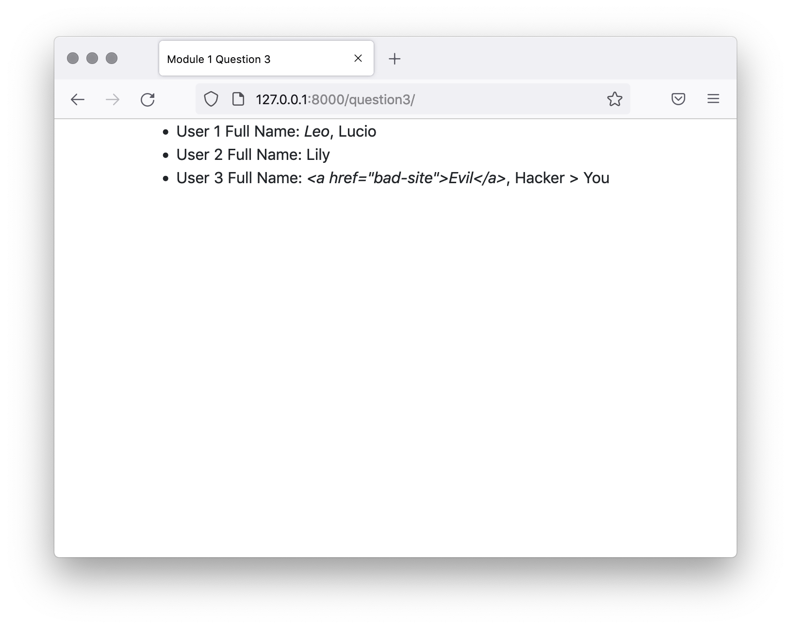

# Question 3

Write a filter that formats a user’s full name. It accepts a User object (not an actual Django User object but a mock instance), which has a `first_name` and `last_name` property.

The filter function `full_name` has been scaffolded in `assessment/templatetags/question3_tags.py` . It’s used in the template `question3.html` which is rendered by the `question3 view. ` you can access it at the `/question3/` URL. You just need to complete the function body of full_name and add any imports you need, you won’t need to change any view or template code.

The `User` object that’s passed to `full_name` will always have a first_name, but the last_name may be None. full_name should format its output based on these rules:
- For first and last name, return <em>{ first name }</em>, { last name }.
- For first name only, return just the user’s first name.
- Make sure to escape any HTML that could be in the first or last name.

This shows what the output page will look like when the filter is implemented correctly.




### Question
```python
from django import template
# Question 3: Add your imports below

register = template.Library()


@register.filter
def full_name(user):
    """
    Question 3: Insert code to build the user's full name below. It should return:
    <em>{{ first_name }}</em>, {{ last_name }}
    if the user has a last name, otherwise:
    {{ first_name }}
    Make sure to escape HTML.
    """
    return ""
```


### Solution
```python
from django import template
# Question 3: Add your imports below
from django.utils.html import format_html

register = template.Library()


@register.filter
def full_name(user):
    """
    Question 3: Insert code to build the user's full name below. It should return:
    <em>{{ last_name }}</em>, {{ first_name }}
    if the user has a last name, otherwise:
    {{ first_name }}
    Make sure to escape HTML.
    """
    if user.last_name:
        return format_html("<em>{}</em>, {}", user.first_name, user.last_name)

    return format_html("{}", user.first_name)
```

- Import format_html from django.utils.html
- Check to see if user.last_name is not equal to None.
- If so, return the last name (with emphasis) comma first name.
- Be sure to use format_html to escape the rendered text.
- If user.last_name is equal to None, return just the first name.
- Again, use format_html to escape the text.