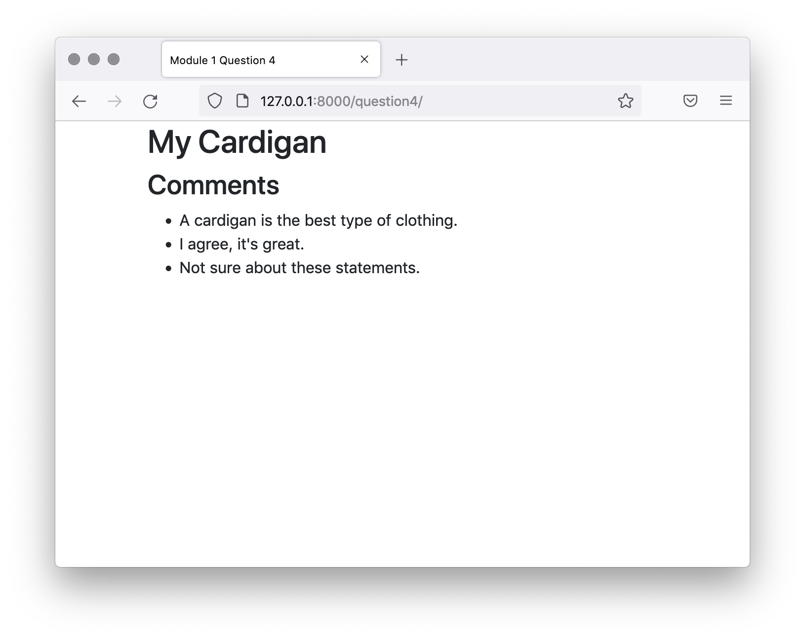

# Question 4
Write a template tag that renders the comments for a Thing. The main template question4.html and template to render comments.html have already been created. The view question4 and URL /question4/ have also been set up, as well as the template tag file question4_tags.py.

Complete the function body of comments_for_thing, making sure that the comments are fetched in alphabetical order of their content. Like with Question 3 you won’t have to edit the views, URLs or template code.

The template tag needs to be registered and render the comments.html template. Once you’ve built it correctly the output page should look like this:




Note that the view automatically creates the Thing and Comment objects so you don’t need to create them yourself. Click the MIGRATE button before running the dev server.


### Problem
```python
from django import template

register = template.Library()


# Question 4: Register the tag


def comments_for_thing(thing):
    # Question 4: Implement code to render the comments for the Thing object below.
    # Sort the comments alphabetically by their content when fetching.
    return {}
```


### Solution New
```python
from django import template
from django.template.loader import render_to_string
from .models import Comment

register = template.Library()

@register.simple_tag
def comments_for_thing(thing):
    # Fetch comments related to the given Thing and sort them alphabetically by content
    comments = Comment.objects.filter(thing=thing).order_by('content')
    # Render the comments using the comments.html template
    return render_to_string('comments.html', {'comments': comments})

```


### Solution old
```python
from django import template

register = template.Library()

# Import the Comment model
from assessment.models import Comment

# Question 4: Register the tag
@register.inclusion_tag('comments.html')
def comments_for_thing(thing):
    # Question 4: Implement code to render the comments for the Thing object below.
    # Sort the comments alphabetically by their content when fetching.
    comments = Comment.objects.filter(content_object=thing).order_by('content')
    return {'comments': comments}
```