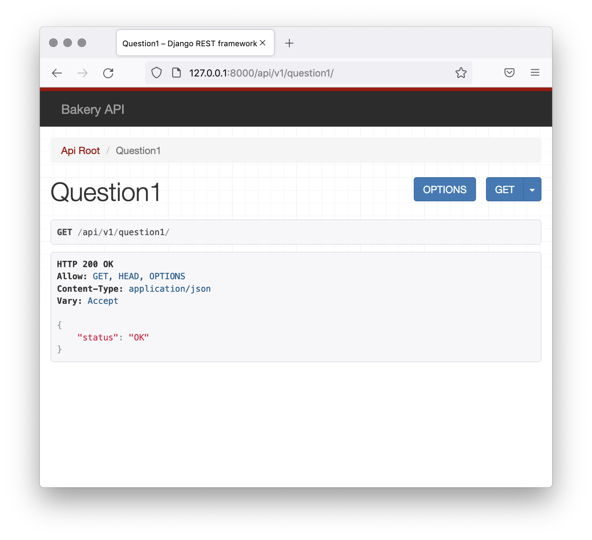

# Django Rest Framework APIs: Question 1
## Question 1
We’ll start off by making a small change to the Django Rest Framework GUI. We want to have the brand in the upper-left corner of the page read Bakery API.
new branding




It should be a link back to the root of the page (href="/"). Make sure you include the correct HTML class as well. You’ll need to create a template to accomplish this. Make sure you create the template and any necessary directories inside the root templates directory which is directly inside the module4 project directory. This directory contains a file called placehholder.html which you can ignore - it’s only there so that the templates directory is not empty because an empty directory would be removed from the repository.
Be sure to run the migrations before launching the dev server.


## Solution

- In the `templates` directory, create the `rest_framework` folder
- In rest_framework, create the `api.html` document
- Your `api.html` document should look as follows


```python



    <a href="/" class="navbar-brand">
        Bakery API
    </a>

```