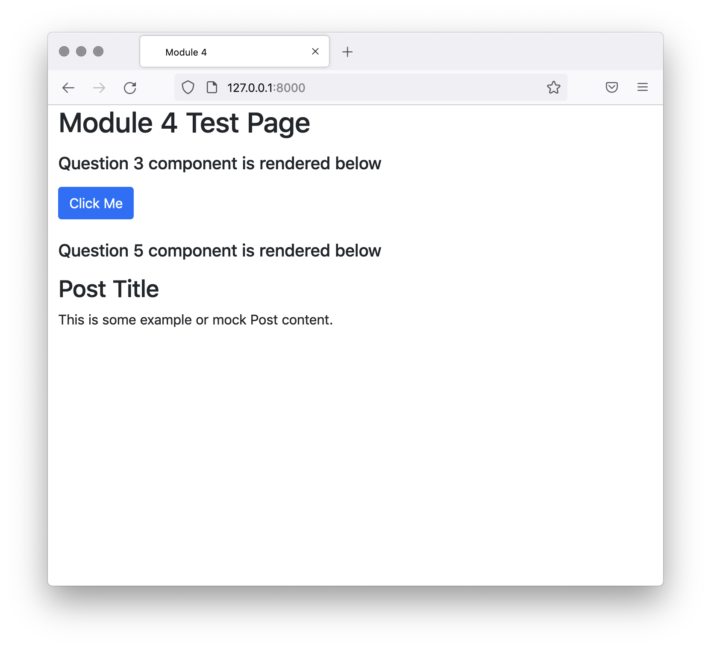

## Integrating JavaScript and the React Framework: Question 5

# Question 5
The PostDisplay React component has been partially created. It is designed to fetch a Post (from the mock endpoint) and display it. To implement the component correctly you will need to do the following:
- Set up the state, with one key, post, that defaults to null.
- Implement the componentDidMount() method. This should fetch() the data from the mock endpoint, decode the JSON, then put it in the state.
- Implement the render method.
    - If the post in the state is null, it should return a <div> with the text Loading....
    - If the post is in the state, it should return a <div> which contains an <h2> with the post’s title and a <p> with the post’s content.

For example, for post data like this:

```json
{"title": "My Post Title", "content": "This is the content of my post."}
```

The returned HTML would be like this:

```html
<div>
    <h2>My Post Title</h2>
    <p>This is the content of my post.</p>
```

This component has been set up to be rendered into the <div> with id="question5-root" on the testing page, under the text Question 5 component is rendered below. You do not need to implement the ReactDOM.render() calls as this has been done.

For reference, this is what the page looks like when post Question 3 and Question 5 complete:
- START DEV SERVER




```js
// Question 5: Complete this component
class PostDisplay extends React.Component {
  state = {
    post: null
  }

  componentDidMount () {
    fetch('/api/v1/mock-post-detail/').then(resp => resp.json()).then((data) => {
      this.setState({post: data})
    })
  }

  render () {
    if (this.state.post == null) {
      return <div>Loading...</div>
    }
    return <div>
      <h2>{this.state.post.title}</h2>
      <p>{this.state.post.content}</p>
    </div>
  }
}

//Question 5 end
```

- Create post as the variable that represents state and set its value to null.
- Fetch post data when the component mounts. The data should be turned into JSON and stored in the post variable via the setState method.
- This class should return a <div>. If the data has not yet been fetched, the <div> should say Loading.... Once fetched, display the title and contents of the post in the <div>.