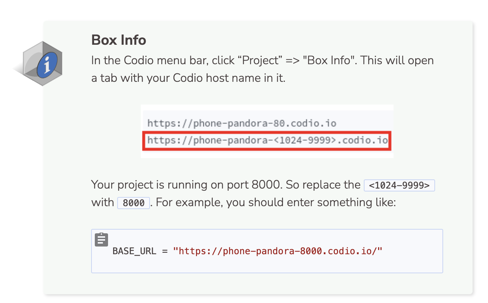

# Capstone Part 1: Intro

## Intro
As we mentioned in the capstone project outline, you will be finishing off the movienight project which has been partially completed. This module is about setting up the UI based features.

There are instructions for each question on how you can interact with the site to check that your code is working as intended. However, the best way to verify your work is to run the unit test by clicking the button that says CHECK YOUR WORK. Use the feedback from the unit test to complete each question.

Because of the way emails are sent, we don’t have access to a Request object, which means we can’t find out the URL of the Django site when sending emails. As a workaround the BASE_URL setting has been hardcoded. It is used when generated the Movie Night invitation emails. You don’t need to make changes to it, but it can make it easier. It should be set to the BASE_URL of your Codio instance (line 135).



**Important**, you should also set up your OMDb key as the OMDB_KEY setting (line 137). Use your OMDb key from OMDb API assignment in the Requests Module and External APIs module.


```py
"""
Django settings for movienight project.

Generated by 'django-admin startproject' using Django 3.2.5.

For more information on this file, see
https://docs.djangoproject.com/en/3.2/topics/settings/

For the full list of settings and their values, see
https://docs.djangoproject.com/en/3.2/ref/settings/
"""
from datetime import timedelta
from pathlib import Path
import os

# Build paths inside the project like this: BASE_DIR / 'subdir'.
BASE_DIR = Path(__file__).resolve().parent.parent

# Quick-start development settings - unsuitable for production
# See https://docs.djangoproject.com/en/3.2/howto/deployment/checklist/

# SECURITY WARNING: keep the secret key used in production secret!
SECRET_KEY = "django-insecure-p5+$5*@#^f3t#1274_h^ro0jnjtfpncj^(mikp#9&eh^u^v4lw"

# SECURITY WARNING: don't run with debug turned on in production!
DEBUG = True

ALLOWED_HOSTS = ["localhost", "0.0.0.0", ".codio.io", os.environ.get('CODIO_HOSTNAME') + '-8000.codio.io']
X_FRAME_OPTIONS = 'ALLOW-FROM ' + os.environ.get('CODIO_HOSTNAME') + '-8000.codio.io'
CSRF_COOKIE_SAMESITE = None
CSRF_TRUSTED_ORIGINS = [os.environ.get('CODIO_HOSTNAME') + '-8000.codio.io']
CSRF_COOKIE_SECURE = True
SESSION_COOKIE_SECURE = True
CSRF_COOKIE_SAMESITE = 'None'
SESSION_COOKIE_SAMESITE = 'None'

# Application definition

# existing code omitted
INSTALLED_APPS = [
    "movienight_auth",
    "django.contrib.admin",
    "django.contrib.auth",
    "django.contrib.contenttypes",
    "django.contrib.sessions",
    "django.contrib.messages",
    "django.contrib.staticfiles",
    "django_registration",
    "crispy_forms",
    "crispy_bootstrap5",
    "movies",
]


MIDDLEWARE = [
    "django.middleware.security.SecurityMiddleware",
    "django.contrib.sessions.middleware.SessionMiddleware",
    "django.middleware.common.CommonMiddleware",
#     "django.middleware.csrf.CsrfViewMiddleware",
    "django.contrib.auth.middleware.AuthenticationMiddleware",
    "django.contrib.messages.middleware.MessageMiddleware",
#     "django.middleware.clickjacking.XFrameOptionsMiddleware",
]

ROOT_URLCONF = "movienight.urls"

TEMPLATES = [
    {
        "BACKEND": "django.template.backends.django.DjangoTemplates",
        "DIRS": [BASE_DIR / "templates"],
        "APP_DIRS": True,
        "OPTIONS": {
            "context_processors": [
                "django.template.context_processors.debug",
                "django.template.context_processors.request",
                "django.contrib.auth.context_processors.auth",
                "django.contrib.messages.context_processors.messages",
            ],
        },
    },
]

WSGI_APPLICATION = "movienight.wsgi.application"

# Database
# https://docs.djangoproject.com/en/3.2/ref/settings/#databases

DATABASES = {
    "default": {
        "ENGINE": "django.db.backends.sqlite3",
        "NAME": BASE_DIR / "db.sqlite3",
    }
}

# Password validation
# https://docs.djangoproject.com/en/3.2/ref/settings/#auth-password-validators

AUTH_PASSWORD_VALIDATORS = [
    {
        "NAME": "django.contrib.auth.password_validation.UserAttributeSimilarityValidator",
    },
    {
        "NAME": "django.contrib.auth.password_validation.MinimumLengthValidator",
    },
    {
        "NAME": "django.contrib.auth.password_validation.CommonPasswordValidator",
    },
    {
        "NAME": "django.contrib.auth.password_validation.NumericPasswordValidator",
    },
]

# Internationalization
# https://docs.djangoproject.com/en/3.2/topics/i18n/

LANGUAGE_CODE = "en-us"

TIME_ZONE = "UTC"

USE_I18N = True

USE_L10N = True

USE_TZ = True

# Static files (CSS, JavaScript, Images)
# https://docs.djangoproject.com/en/3.2/howto/static-files/

STATIC_URL = "/static/"

# Default primary key field type
# https://docs.djangoproject.com/en/3.2/ref/settings/#default-auto-field

DEFAULT_AUTO_FIELD = "django.db.models.BigAutoField"

AUTH_USER_MODEL = "movienight_auth.User"

EMAIL_BACKEND = "django.core.mail.backends.console.EmailBackend"

BASE_URL = ""

OMDB_KEY = ""


# existing code omitted
CRISPY_ALLOWED_TEMPLATE_PACKS = "bootstrap5"
CRISPY_TEMPLATE_PACK = "bootstrap5"
ACCOUNT_ACTIVATION_DAYS = 7
```