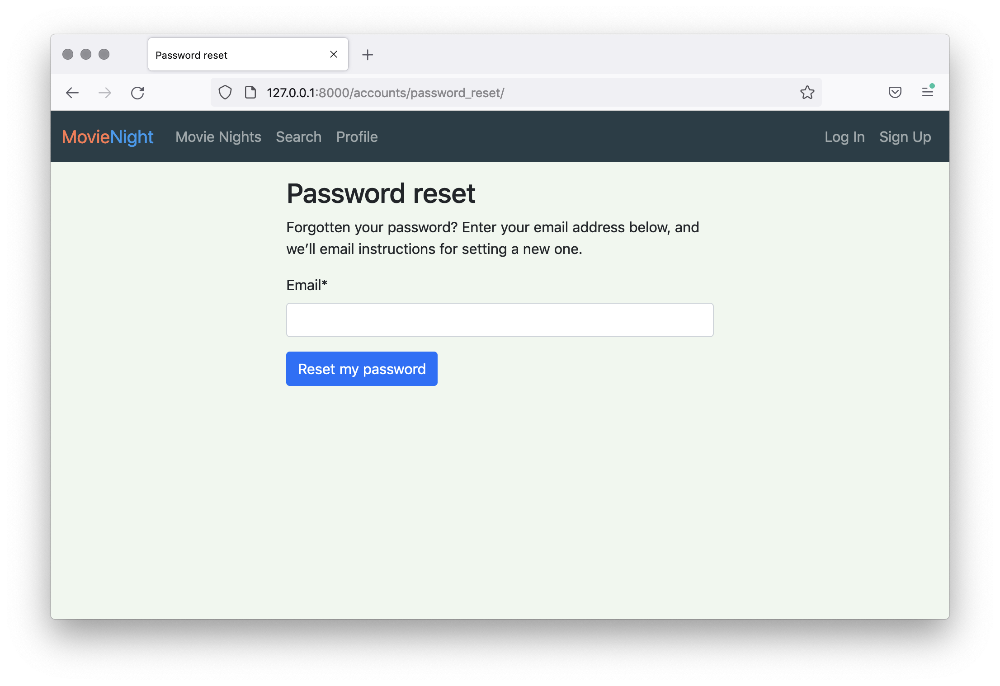

# Current layout: 1 Panel without tree

## Movie Night
In the last two modules of this course you will be working on a project that brings together many of the things you have learned from Courses 1 to 4. You will be working on the project called Movie Night which aims to make it easier to organize times to watch movies with friends.

First we’ll go through a high-level description of the site’s features, then show some screenshots of it.
- Users can register with their email address and a password.
- Users can log in with their email address.
- Users can search for a movie by title.
    - The movie data will be retrieved from OMDb if the term has not been searched in the past 24 hours.
- Users can create a Movie Night for a movie, at a specific date and time.
- Once a Movie Night is created, other users can be invited by the creator.
    - Users will receive an invitation email when they’re invited.
- Users can confirm their attendance or decline the invitation (as well as switch back and forth between these states).
    - The creator of the Movie Night will receive an email when invitees change their attendance status.
- Half an hour before a Movie Night is due to start, all the confirmed attendees, and the creator, are emailed a notification.
- All emailing takes place through Celery. Celery Beat is used for scheduling.
- A REST API is also implemented.
- Django Configurations and logging are set up to work as a 12-Factor app.

Some of these features will be implemented in this module, and the remainder in the next module.

### Screenshot Tour
Let’s take a short tour through some of the features of Movie Night. First, here is the home page:


If we visit the Sign Up page, we get a registration form.


We need to register with an email address and password.


Then an email is triggered (we’ll use the console email backend to deliver emails to the console for testing). It has a link to click to verify the account. This uses Django Registration’s two-step workflow:

```sh
Hi,
You registered for Movie Night, but you need to activate your account within 7 days.
To do that, please visit this page:
http://127.0.0.1:8000/accounts/activate/ImJlbkBleGFtcGxlLmNvbSI:1mXytA:3xI7GATnm9Eu2C1RNCDe6sYkSPheHp1pmjfzpk84vEE/
Thanks,
The Movie Night Team
```

After activating the account we’ll go to the activation complete screen.


And then we can log in in the usual manner. If we’ve forgotten our password, we can reset it with the reset password form.




After a successful login, we’ll see the profile page. It doesn’t show much except the user’s email address.


To create a Movie Night, we need to start with a Movie. To populate some Movies in the database, start by performing a Movie Search (click the Search link at the top of the screen).


After the search completes (it can take some time if it’s a new search) you’ll see a list of results.
search results


After clicking on [Details] for a particular Movie we’re taken to the movie details page. Note that before the view is rendered the full movie details are fetched from OMDb, if the Movie is not already a full record. On the Movie details page we have a single field, to select a start time for a new movie night.


After creation, we’re taken to the Movie Night detail page which shows information about the movie and a list of invitees, as well as their responses. Right now there are no invitees, but we can add them by entering their email address (they must already have an account on the site).


After inviting someone, the invited user will receive an email, for example:


```sh
Hi,

ben@example.com has invited you to watch Star Wars: Episode I - The Phantom Menace at Oct. 7, 2021, 9 p.m.

To confirm your attendance, please visit http://127.0.0.1:8000/movie-nights/1/

Thanks,
The Movie Night team
```

They can view the list of invitees and update their response.


They are created and invited movie nights also displayed on the Movie Night list page (found by clicking Movie Nights in the navbar).


After updating their response, the creator of the Movie Night and other invitees can see their response on the Movie Night detail page.


The creator of the Movie Night will receive an email letting them know that the status has been updated:

```sh
Hi,

leo@example.com has updated their attendance status to your Movie Night for
Star Wars: Episode I - The Phantom Menace.

They will be attending your Movie Night.

To see the full list of attendees, please visit http://127.0.0.1:8000/movie-nights/1/

Thanks,
The Movie Night Team
```

Project Scaffold
A lot of the project has already been scaffolded for you, for speed of development and so that the result can be tested in a consistent manner. We’ve already set up most of the standard Django features and you will be implementing things that you have learned during this course. For example, you won’t need to set up models, views, URLs or forms (although you will need to make some changes to some of these). The Django Admin has also been set up so you can make changes to model instances using that interface.
With that said, you will need to complete these tasks with less guidance than in previous assessments, however you should not find them too difficult and you can refer to previous material for help.
Now, on to the questions.
Next