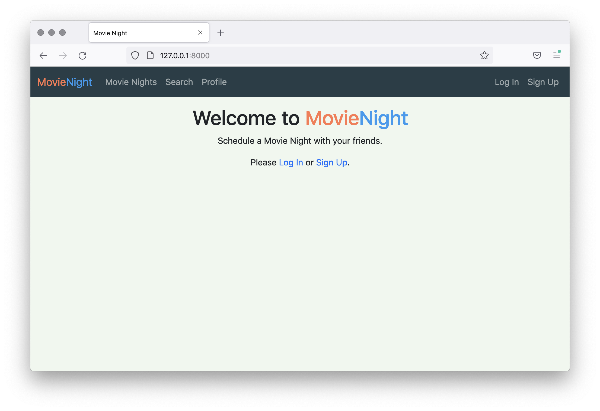

# Capstone Part 1: Question 2

## Question 2
The look of the website is not quite right at the moment, because we’re not including the Bootstrap CSS or JavaScript files. Template files have been set up for you to complete with the right elements.
- templates/_bootstrap_head.html should be populated with the elements that are needed to include Bootstrap, in the <head> of the page. Hint: you will need two <meta> elements and one <link> element.
- templates/_bootstrap_scripts.html needs to have the Bootstrap bundle <script> element added to it.
- templates/base.html needs to have a container <div> added around the  template tags. It should be a fluid container and have a padding top of size 3.

The Bootstrap documentation will help you here:
- Starter template
- Containers
- Spacing

# Expected Output
You should see the following page when loading Movie Night in the browser.



- START DEV SERVER

View Movie Night
Your code should pass all of the unit tests.


## Task
```html
<!doctype html>
<html lang="en">
<head>
    
    <title>{{ title }}Movie Night</title>
    <style>
        body {
            background: #f0f7ee;
        }

        .navbar.bg-dark {
            background-color: #273e47 !important;
        }

        .movie {
            color: #ff784f;
        }

        .night {
            color: #279af1;
        }
    </style>
</head>
<body>

    
    



</body>
</html>
```

## Solution
```html
<!-- _bootstrap_head.html -->

<meta charset="utf-8">
<meta name="viewport" content="width=device-width, initial-scale=1">
<link href="https://cdn.jsdelivr.net/npm/bootstrap@5.1.1/dist/css/bootstrap.min.css" rel="stylesheet"
      integrity="sha384-F3w7mX95PdgyTmZZMECAngseQB83DfGTowi0iMjiWaeVhAn4FJkqJByhZMI3AhiU" crossorigin="anonymous">
```
- Use UTF-8 as the website’s character encoding.
- Set up the viewport for responsive design.
- Include Bootstrap in the <head> of the page.


```html
<!-- _bootstrap_scripts.html -->

<script src="https://cdn.jsdelivr.net/npm/bootstrap@5.1.1/dist/js/bootstrap.bundle.min.js"
        integrity="sha384-/bQdsTh/da6pkI1MST/rWKFNjaCP5gBSY4sEBT38Q/9RBh9AH40zEOg7Hlq2THRZ"
        crossorigin="anonymous">
</script>
```

```
- Add the <script> that includes the Bootstrap bundle for the Django project.
base
```

```html
<!-- base.html -->

<!-- Existing code omitted -->

<body>

<div class="container-fluid pt-3">
    
    
</div>



</body>
```

In the <body> tag, create a <div> around the block content.
Assign the classes container-fluid and pt-3 to the <div>.
