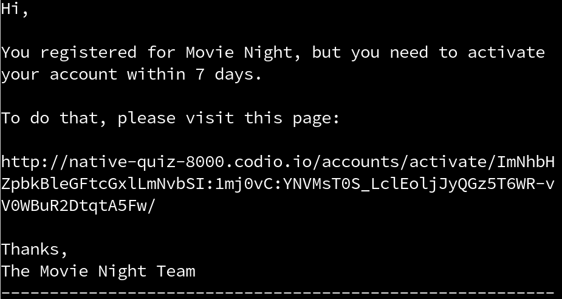
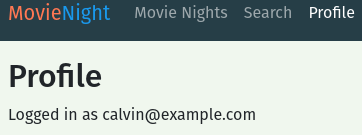

# Capstone Part 1: Question 3

## Question 3
The two-step registration workflow needs to be configured. Before this can be set up, we need to enable Django Crispy forms for the project, and configure RegistrationForm (in movienight_auth/forms.py) to use it.

You will need to:
- Add the Crispy Forms (and its Bootstrap 5 libraries) to INSTALLED_APPS.
- Add the settings to enable the Bootstrap 5 template packs.
- Set up the RegistrationForm's Meta attribute.
- Add a FormHelper with a Submit button to the RegistrationForm.

After the form configuration is done, then you’ll need to configure Django registration’s URLs. The templates have already been set up for you. The first step is to add the Django Registration app to INSTALLED_APPS, and don’t forget the ACCOUNT_ACTIVATION_DAYS setting too. You will need to make the migrations after adding Django Registration as an installed app.
- MAKEMIGRATIONS
- MIGRATE

Then in movienight/urls.py, map accounts/register/ to the RegistrationView, making sure to pass movienight_auth.forms.RegistrationForm as an argument. Also map accounts/ to Django Registration’s activation URLs. Make sure this is added before the existing accounts/ pattern.

### Expected Output
Loading Movie Night in the browser and create a user with the registration form. Remember the email and password as you will use that information on the following questions as well.
- START DEV SERVER

View Movie Night
After signing up, check the terminal for the registration email. Click on the link to complete the two-step process.


Login with the email and password. You should see your profile page if everything is working as expected.



Your code should pass all of the unit tests.

## Task
```py
# urls.py

"""movienight URL Configuration

The `urlpatterns` list routes URLs to views. For more information please see:
    https://docs.djangoproject.com/en/3.2/topics/http/urls/
Examples:
Function views
    1. Add an import:  from my_app import views
    2. Add a URL to urlpatterns:  path('', views.home, name='home')
Class-based views
    1. Add an import:  from other_app.views import Home
    2. Add a URL to urlpatterns:  path('', Home.as_view(), name='home')
Including another URLconf
    1. Import the include() function: from django.urls import include, path
    2. Add a URL to urlpatterns:  path('blog/', include('blog.urls'))
"""
from django.contrib import admin
from django.urls import path, include

import movienight_auth.views
import movies.views

urlpatterns = [
    path("admin/", admin.site.urls),
    path("accounts/profile/", movienight_auth.views.profile, name="profile"),
    path("accounts/", include("django.contrib.auth.urls")),
    path("", movies.views.index),
    path("movie-nights/", movies.views.movie_night_list, name="movie_night_list_ui"),
    path(
        "movie-nights/<int:pk>/",
        movies.views.movie_night_detail,
        name="movie_night_detail_ui",
    ),
    path("search/", movies.views.movie_search, name="movie_search_ui"),
    path("movies/<slug:imdb_id>/", movies.views.movie_detail, name="movie_detail_ui"),
]
```

```py
# settings.py

"""
Django settings for movienight project.

Generated by 'django-admin startproject' using Django 3.2.5.

For more information on this file, see
https://docs.djangoproject.com/en/3.2/topics/settings/

For the full list of settings and their values, see
https://docs.djangoproject.com/en/3.2/ref/settings/
"""
from datetime import timedelta
from pathlib import Path
import os

# Build paths inside the project like this: BASE_DIR / 'subdir'.
BASE_DIR = Path(__file__).resolve().parent.parent

# Quick-start development settings - unsuitable for production
# See https://docs.djangoproject.com/en/3.2/howto/deployment/checklist/

# SECURITY WARNING: keep the secret key used in production secret!
SECRET_KEY = "django-insecure-p5+$5*@#^f3t#1274_h^ro0jnjtfpncj^(mikp#9&eh^u^v4lw"

# SECURITY WARNING: don't run with debug turned on in production!
DEBUG = True

ALLOWED_HOSTS = ["localhost", "0.0.0.0", ".codio.io", os.environ.get('CODIO_HOSTNAME') + '-8000.codio.io']
X_FRAME_OPTIONS = 'ALLOW-FROM ' + os.environ.get('CODIO_HOSTNAME') + '-8000.codio.io'
CSRF_COOKIE_SAMESITE = None
CSRF_TRUSTED_ORIGINS = [os.environ.get('CODIO_HOSTNAME') + '-8000.codio.io']
CSRF_COOKIE_SECURE = True
SESSION_COOKIE_SECURE = True
CSRF_COOKIE_SAMESITE = 'None'
SESSION_COOKIE_SAMESITE = 'None'

# Application definition

INSTALLED_APPS = [
    "movienight_auth",
    "django.contrib.admin",
    "django.contrib.auth",
    "django.contrib.contenttypes",
    "django.contrib.sessions",
    "django.contrib.messages",
    "django.contrib.staticfiles",
    "movies",
]

MIDDLEWARE = [
    "django.middleware.security.SecurityMiddleware",
    "django.contrib.sessions.middleware.SessionMiddleware",
    "django.middleware.common.CommonMiddleware",
#     "django.middleware.csrf.CsrfViewMiddleware",
    "django.contrib.auth.middleware.AuthenticationMiddleware",
    "django.contrib.messages.middleware.MessageMiddleware",
#     "django.middleware.clickjacking.XFrameOptionsMiddleware",
]

ROOT_URLCONF = "movienight.urls"

TEMPLATES = [
    {
        "BACKEND": "django.template.backends.django.DjangoTemplates",
        "DIRS": [BASE_DIR / "templates"],
        "APP_DIRS": True,
        "OPTIONS": {
            "context_processors": [
                "django.template.context_processors.debug",
                "django.template.context_processors.request",
                "django.contrib.auth.context_processors.auth",
                "django.contrib.messages.context_processors.messages",
            ],
        },
    },
]

WSGI_APPLICATION = "movienight.wsgi.application"

# Database
# https://docs.djangoproject.com/en/3.2/ref/settings/#databases

DATABASES = {
    "default": {
        "ENGINE": "django.db.backends.sqlite3",
        "NAME": BASE_DIR / "db.sqlite3",
    }
}

# Password validation
# https://docs.djangoproject.com/en/3.2/ref/settings/#auth-password-validators

AUTH_PASSWORD_VALIDATORS = [
    {
        "NAME": "django.contrib.auth.password_validation.UserAttributeSimilarityValidator",
    },
    {
        "NAME": "django.contrib.auth.password_validation.MinimumLengthValidator",
    },
    {
        "NAME": "django.contrib.auth.password_validation.CommonPasswordValidator",
    },
    {
        "NAME": "django.contrib.auth.password_validation.NumericPasswordValidator",
    },
]

# Internationalization
# https://docs.djangoproject.com/en/3.2/topics/i18n/

LANGUAGE_CODE = "en-us"

TIME_ZONE = "UTC"

USE_I18N = True

USE_L10N = True

USE_TZ = True

# Static files (CSS, JavaScript, Images)
# https://docs.djangoproject.com/en/3.2/howto/static-files/

STATIC_URL = "/static/"

# Default primary key field type
# https://docs.djangoproject.com/en/3.2/ref/settings/#default-auto-field

DEFAULT_AUTO_FIELD = "django.db.models.BigAutoField"

AUTH_USER_MODEL = "movienight_auth.User"

EMAIL_BACKEND = "django.core.mail.backends.console.EmailBackend"

BASE_URL = ""

OMDB_KEY = ""
```

```py
# forms.py

from django_registration.forms import RegistrationForm as DefaultRegistrationForm


class RegistrationForm(DefaultRegistrationForm):
    pass
```


## Solution
```py
# forms.py

from django_registration.forms import RegistrationForm as DefaultRegistrationForm
from crispy_forms.helper import FormHelper
from crispy_forms.layout import Submit
from .models import User

class RegistrationForm(DefaultRegistrationForm):
    class Meta(DefaultRegistrationForm.Meta):
        model = User

    def __init__(self, *args, **kwargs):
        super(RegistrationForm, self).__init__(*args, **kwargs)
        self.helper = FormHelper()
        self.helper.add_input(Submit("submit", "Register"))
```
- Import FormHelper and Submit from crispy_forms.
- Import the User model.
- Add Meta to the RegistrationForm.
- In the constructor, add FormHelper to RegistrationForm.
- Add a submit button with the text "Register".

```py
# settings

# existing code omitted

INSTALLED_APPS = [
    "movienight_auth",
    "django.contrib.admin",
    "django.contrib.auth",
    "django.contrib.contenttypes",
    "django.contrib.sessions",
    "django.contrib.messages",
    "django.contrib.staticfiles",
    "django_registration",
    "crispy_forms",
    "crispy_bootstrap5",
    "movies",
]

# existing code omitted

CRISPY_ALLOWED_TEMPLATE_PACKS = "bootstrap5"
CRISPY_TEMPLATE_PACK = "bootstrap5"
ACCOUNT_ACTIVATION_DAYS = 7
```

- Add django_registration, crispy_forms, and crispy_boostrap5 to INSTALLED_APPS.
- Set CRISPY_ALLOWED_TEMPLATE_PACKS and CRISPY_TEMPLATE_PACK to "bootstrap5".
- Set the account activation days to 7.


```py
# urls.py

from django.contrib import admin
from django.urls import path, include
from django_registration.backends.activation.views import RegistrationView

import movienight_auth.views
import movies.views
from movienight_auth.forms import RegistrationForm

urlpatterns = [
    path("admin/", admin.site.urls),
    path("accounts/profile/", movienight_auth.views.profile, name="profile"),
    path(
        "accounts/register/",
        RegistrationView.as_view(form_class=RegistrationForm),
        name="django_registration_register",
    ),
    path("accounts/", include("django_registration.backends.activation.urls")),
    path("accounts/", include("django.contrib.auth.urls")),
    path("", movies.views.index),
    path("movie-nights/", movies.views.movie_night_list, name="movie_night_list_ui"),
    path(
        "movie-nights/<int:pk>/",
        movies.views.movie_night_detail,
        name="movie_night_detail_ui",
    ),
    path("search/", movies.views.movie_search, name="movie_search_ui"),
    path("movies/<slug:imdb_id>/", movies.views.movie_detail, name="movie_detail_ui"),
]
```
- Import RegistrationView from the registration module.
- Import RegistrationForm from movienight_auth.forms.
- Have accounts/register/ map to the RegistrationView.
- Have accounts/ map to Django Registration’s activation URLs.