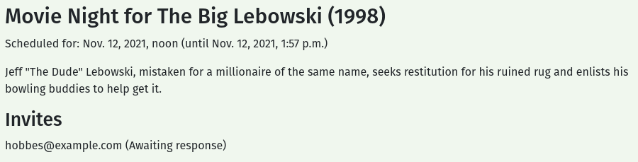
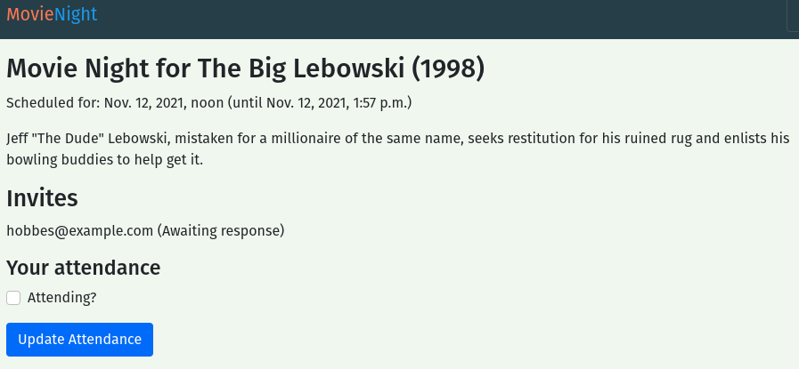

# Capstone Part 1: Question 4

## Question 4
The MovieNightForm, InviteeForm and AttendanceForm in movies/forms.py need to be made to work with Django Crispy Forms. AttendanceForm already has an __init__() method, the others will need to have __init__() methods added. The __init__() method for each form should add a FormHelper with a Submit button. The label for each submit button should be:
- Create for MovieNightForm
- Invite for InviteeForm
- Update Attendance for AttendanceForm

### Expected Output
You need multiple users to test your code. You already created a user for Question 3, so you need to make another one. Use the CREATE SUPERUSER button to create a second user (this is a bit faster than using Movie Night website to create a new user).
- CREATE SUPERUSER

Once the second user has been created, start the site.
- START DEV SERVER

- View Movie Night

Log n as the first user, create an event, and invite the second user.



Log out as the first user and login as the second. Verify that you can see the invitation.



Remember the information for these users, you will need it for Question 5. Your code should pass all of the unit tests.
- CHECK YOUR WORK

```py
from django import forms
from django.contrib.auth import get_user_model
from django.core.exceptions import ValidationError

from movies.models import MovieNight, MovieNightInvitation

UserModel = get_user_model()


class SearchForm(forms.Form):
    term = forms.CharField(required=False)


class MovieNightForm(forms.ModelForm):
    class Meta:
        model = MovieNight
        fields = ["start_time"]


class InviteeForm(forms.Form):
    email = forms.EmailField()

    _user = False

    def clean_email(self):
        email = self.cleaned_data["email"]
        try:
            # cache for later
            self._user = UserModel.objects.get(email=email)
        except UserModel.DoesNotExist:
            raise ValidationError(f"User with email address '{email}' was not found.")

        return email


class AttendanceForm(forms.ModelForm):
    class Meta:
        model = MovieNightInvitation
        fields = ["is_attending"]

    def __init__(self, *args, **kwargs):
        super(AttendanceForm, self).__init__(*args, **kwargs)
        self.fields["is_attending"].label = "Attending?"
```

## Solution

### Imports
```py
from crispy_forms.helper import FormHelper
from crispy_forms.layout import Submit
```

- Import FormHelper and Submit from crispy_forms.

### Movie Night Form
```py
#existing code omitted

    def __init__(self, *args, **kwargs):
        super(MovieNightForm, self).__init__(*args, **kwargs)
        self.helper = FormHelper()
        self.helper.add_input(Submit("submit", "Create"))
```
- Create the constructor.
- Create a submit button with the text "Create".

### Invitee Form
```py
# existing code omitted

    def __init__(self, *args, **kwargs):
        super(InviteeForm, self).__init__(*args, **kwargs)
        self.helper = FormHelper()
        self.helper.add_input(Submit("submit", "Invite"))

# existing code omitted
```
- Create the constructor.
- Create a submit button with the text "Invite"


### Attendance Form
```py
# existing code omitted

    def __init__(self, *args, **kwargs):
        super(AttendanceForm, self).__init__(*args, **kwargs)
        self.fields["is_attending"].label = "Attending?"
        self.helper = FormHelper()
        self.helper.add_input(Submit("submit", "Update Attendance"))
```
- Update the constructor with a submit button that has the text "Update Attendance".