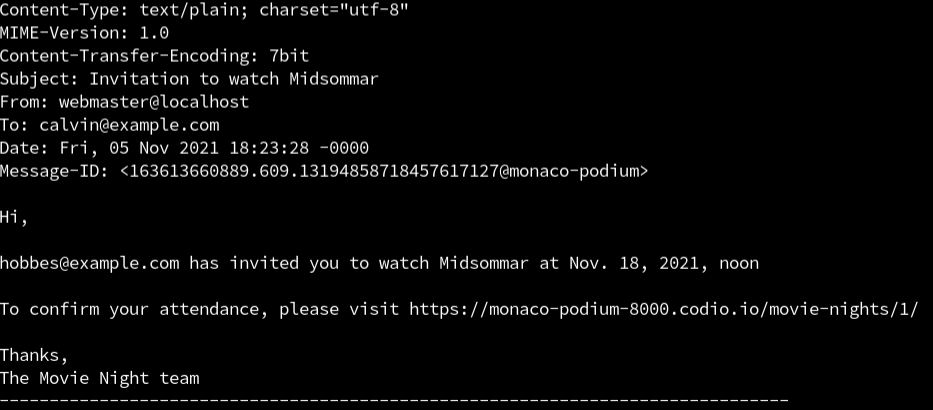
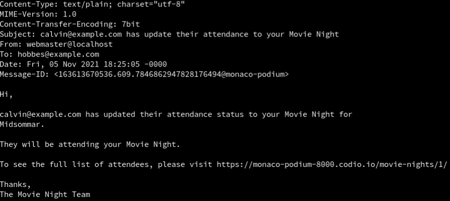

# Capstone Part 1: Question 5

## Question 5
We want to use Signals to trigger the email sending when an invitation is created or updated. The signal functions invitation_create() and invitation_update() have already been set up in movies/signals.py, so you do not need to edit them. You will need to add receivers to them so these functions are called when the signals are triggered.

invitation_create() should be called when the post_save signal is triggered. Make sure the sender is limited to MovieNightInvitation, and it’s set up with a dispatch_uid of invitation_create.

invitation_update() should be called when the pre_save signal is triggered. Again, be sure the sender is limited to MovieNightInvitation, and it’s set up with a dispatch_uid of invitation_update.

Don’t change the USE_CELERY variable in this file.

In order to get signals.py read and executed, you’ll also need to add a method which imports this file. This is done on the MoviesConfig class in movies/apps.py.

### Expected Output
Start the dev server. Using the user information from Questions 3 and 4, log in to Movie Night

- View Movie Night

Create a movie night and invite the other user. You should see the invitation email being “sent” in the terminal output.



Then log in as the other user and respond to the invite. You should see response emails being “sent” as they change to attending/not attending.



Your code should pass all of the unit tests.
- CHECK YOUR WORK


## Task
```py
# apps.py

from django.apps import AppConfig


class MoviesConfig(AppConfig):
    default_auto_field = "django.db.models.BigAutoField"
    name = "movies"
```

```py
# signals.py

from movies.models import MovieNightInvitation
from movies.tasks import send_invitation, send_attendance_change

USE_CELERY = False


def invitation_create(sender, created, instance, **kwargs):
    if created:
        if USE_CELERY:
            send_invitation.delay(instance.pk)
        else:
            send_invitation(instance.pk)


def invitation_update(sender, instance, **kwargs):
    if not instance.pk:
        # is a new one
        return

    previous_invitation = MovieNightInvitation.objects.get(pk=instance.pk)
    instance.attendance_confirmed = True

    # only notify if there is a change in attendance
    if previous_invitation.is_attending != instance.is_attending:
        if USE_CELERY:
            send_attendance_change.delay(instance.pk, instance.is_attending)
        else:
            send_attendance_change(instance.pk, instance.is_attending)
```


## Solution

```py
# signals.py

from django.db.models.signals import pre_save, post_save
from django.dispatch import receiver

from movies.models import MovieNightInvitation
from movies.tasks import send_invitation, send_attendance_change

USE_CELERY = False


@receiver(post_save, sender=MovieNightInvitation, dispatch_uid="invitation_create")
def invitation_create(sender, created, instance, **kwargs):
    if created:
        if USE_CELERY:
            send_invitation.delay(instance.pk)
        else:
            send_invitation(instance.pk)


@receiver(pre_save, sender=MovieNightInvitation, dispatch_uid="invitation_update")
def invitation_update(sender, instance, **kwargs):
    if not instance.pk:
        # is a new one
        return

# existing code omitted
```
- Import the pre_save and post_save signals.
- Add the @receiver decorator to the invitation_create method. This method receives the post_save signal. It should only respond to the MovieNightInvitation sender and use invitation_create as its unique ID.
- Add the @receiver decorator to the invitation_update method. This method receives the pre_save signal. It should only respond to the MovieNightInvitation sender and use invitation_update as its unique ID.


```py
# apps.py

from django.apps import AppConfig

class MoviesConfig(AppConfig):
    default_auto_field = "django.db.models.BigAutoField"
    name = "movies"

    def ready(self):
        import movies.signals  # noqa
```
- Create the ready method that imports movies.signals.
- Don’t forget to add noqa as a comment so that a linter will not flag this line with a warning.