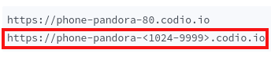

# Capstone Part 2: Intro

## Intro
The movienight project carries on from where you finished off in Module 3, with the additions of DRF views, serializers and URL patterns.

There are instructions for each questions on how you can interact with the site to check that your code is working as intended. However, the best way to verify your work is to run the unit test by clicking the button that says CHECK YOUR WORK. Use the feedback from the unit test to complete each question.
Just as in the first part of the capstone project, you will need to set the BASE_URL of your Codio instance (line 145).

## Box Info
In the Codio menu bar, click “Project” => "Box Info". This will open a tab with your Codio hostname in it.




Your project is running on port 8000. So replace the <1024-9999> with 8000. For example, you should enter something like:

```sh
BASE_URL = "https://phone-pandora-8000.codio.io/"
```

Important, you should also set up your OMDb key as the OMDB_KEY setting (line 147). Use your OMDb key from OMDb API assignment in the Requests Module and External APIs module.
