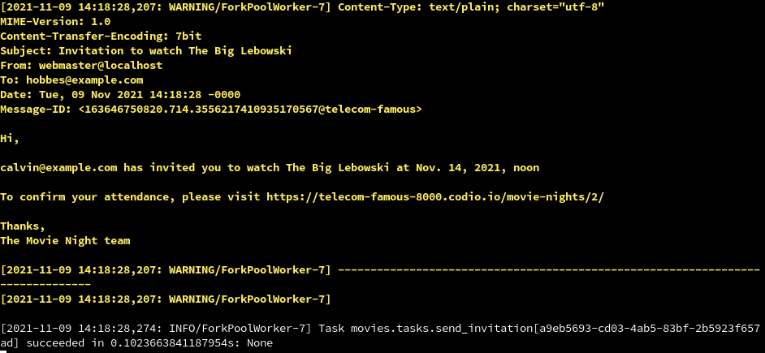

# Capstone Part 2: Question 4


## Question 4
Sometimes it could take a while to send out notification emails, so we want to use Celery for this. The Celery app is already set up for the project, some settings just need to be configured.

First changes need to be made to INSTALLED_APPS to store the results in the Django DB. Then, CELERY_RESULT_BACKEND and CELERY_BROKER_URL need to be configured appropriately. You will have to migrate after this.

- MIGRATE

Task functions have been set written in movies/tasks.py but they have not been configured to be run as Celery tasks. Import the right decorator function and use it on send_invitation, send_attendance_change and notify_of_starting_soon.

After you have done this, USE_CELERY in movies/signals.py can be set to True.

### Expected Output
Using the superuser information from Question 2 and the MovieNight website, DRF, or PostMan, create and respond to invitations for a MovieNight event.
- START DEV SERVER

- View Movie Night
Open another terminal to view the tasks being executed via a Celery worker.

### Celery Worker
Open a second terminal, by clicking Tools in the Codio menu bar. Then click Terminal. Change directories to movienight.
```sh
cd movie-night/module4/movienight
```

Then enter the following command in the terminal to launch a Celery worker.
```sh
celery -A movienight worker -l DEBUG
```

Upon saving invitations, Celery will execute the notification tasks. You should see this happening in the Celery worker terminal.


- Click here to see a larger version of the image

Your code should pass all of the unit tests.


- CHECK YOUR WORK
Submit your code for evaluation.


## Tasks

```py
# signals.py

from django.db.models.signals import pre_save, post_save
from django.dispatch import receiver

from movies.models import MovieNightInvitation
from movies.tasks import send_invitation, send_attendance_change

USE_CELERY = False


@receiver(post_save, sender=MovieNightInvitation, dispatch_uid="invitation_create")
def invitation_create(sender, created, instance, **kwargs):
    if created:
        if USE_CELERY:
            send_invitation.delay(instance.pk)
        else:
            send_invitation(instance.pk)


@receiver(pre_save, sender=MovieNightInvitation, dispatch_uid="invitation_update")
def invitation_update(sender, instance, **kwargs):
    if not instance.pk:
        # is a new one
        return

    previous_invitation = MovieNightInvitation.objects.get(pk=instance.pk)
    instance.attendance_confirmed = True

    # only notify if there is a change in attendance
    if previous_invitation.is_attending != instance.is_attending:
        if USE_CELERY:
            send_attendance_change.delay(instance.pk, instance.is_attending)
        else:
            send_attendance_change(instance.pk, instance.is_attending)
```

```py
# tasks.py

from movies import notifications
from movies.models import MovieNightInvitation


def send_invitation(mni_pk):
    notifications.send_invitation(MovieNightInvitation.objects.get(pk=mni_pk))


def send_attendance_change(mni_pk, is_attending):
    notifications.send_attendance_change(
        MovieNightInvitation.objects.get(pk=mni_pk), is_attending
    )


def notify_of_starting_soon():
    notifications.notify_of_starting_soon()

```


```py
# settings.py

from datetime import timedelta
from pathlib import Path
import os
from configurations import Configuration, values

class Dev(Configuration):
    # Build paths inside the project like this: BASE_DIR / 'subdir'.
    BASE_DIR = Path(__file__).resolve().parent.parent

    # Quick-start development settings - unsuitable for production
    # See https://docs.djangoproject.com/en/3.2/howto/deployment/checklist/

    # SECURITY WARNING: keep the secret key used in production secret!
    SECRET_KEY = "django-insecure-p5+$5*@#^f3t#1274_h^ro0jnjtfpncj^(mikp#9&eh^u^v4lw"

    # SECURITY WARNING: don't run with debug turned on in production!
    DEBUG = True

    ALLOWED_HOSTS = ["localhost", "0.0.0.0", ".codio.io", os.environ.get('CODIO_HOSTNAME') + '-8000.codio.io']
    X_FRAME_OPTIONS = 'ALLOW-FROM ' + os.environ.get('CODIO_HOSTNAME') + '-8000.codio.io'
    CSRF_COOKIE_SAMESITE = None
    CSRF_TRUSTED_ORIGINS = [os.environ.get('CODIO_HOSTNAME') + '-8000.codio.io']
    CSRF_COOKIE_SECURE = True
    SESSION_COOKIE_SECURE = True
    CSRF_COOKIE_SAMESITE = 'None'
    SESSION_COOKIE_SAMESITE = 'None'

    # Application definition

    INSTALLED_APPS = [
        "movienight_auth",
        "django.contrib.admin",
        "django.contrib.auth",
        "django.contrib.contenttypes",
        "django.contrib.sessions",
        "django.contrib.messages",
        "django.contrib.staticfiles",
        "django_registration",
        "crispy_forms",
        "crispy_bootstrap5",
        "movies",
        "rest_framework",
        "rest_framework.authtoken",
    ]

    MIDDLEWARE = [
        "django.middleware.security.SecurityMiddleware",
        "django.contrib.sessions.middleware.SessionMiddleware",
        "django.middleware.common.CommonMiddleware",
        # "django.middleware.csrf.CsrfViewMiddleware",
        "django.contrib.auth.middleware.AuthenticationMiddleware",
        "django.contrib.messages.middleware.MessageMiddleware",
        # "django.middleware.clickjacking.XFrameOptionsMiddleware",
    ]

    ROOT_URLCONF = "movienight.urls"

    TEMPLATES = [
        {
            "BACKEND": "django.template.backends.django.DjangoTemplates",
            "DIRS": [BASE_DIR / "templates"],
            "APP_DIRS": True,
            "OPTIONS": {
                "context_processors": [
                    "django.template.context_processors.debug",
                    "django.template.context_processors.request",
                    "django.contrib.auth.context_processors.auth",
                    "django.contrib.messages.context_processors.messages",
                ],
            },
        },
    ]

    WSGI_APPLICATION = "movienight.wsgi.application"

    # Database
    # https://docs.djangoproject.com/en/3.2/ref/settings/#databases

    DATABASES = {
        "default": {
            "ENGINE": "django.db.backends.sqlite3",
            "NAME": BASE_DIR / "db.sqlite3",
        }
    }

    # Password validation
    # https://docs.djangoproject.com/en/3.2/ref/settings/#auth-password-validators

    AUTH_PASSWORD_VALIDATORS = [
        {
            "NAME": "django.contrib.auth.password_validation.UserAttributeSimilarityValidator",
        },
        {
            "NAME": "django.contrib.auth.password_validation.MinimumLengthValidator",
        },
        {
            "NAME": "django.contrib.auth.password_validation.CommonPasswordValidator",
        },
        {
            "NAME": "django.contrib.auth.password_validation.NumericPasswordValidator",
        },
    ]

    # Internationalization
    # https://docs.djangoproject.com/en/3.2/topics/i18n/

    LANGUAGE_CODE = "en-us"

    TIME_ZONE = values.Value("UTC")

    USE_I18N = True

    USE_L10N = True

    USE_TZ = True

    # Static files (CSS, JavaScript, Images)
    # https://docs.djangoproject.com/en/3.2/howto/static-files/

    STATIC_URL = "/static/"

    # Default primary key field type
    # https://docs.djangoproject.com/en/3.2/ref/settings/#default-auto-field

    DEFAULT_AUTO_FIELD = "django.db.models.BigAutoField"

    AUTH_USER_MODEL = "movienight_auth.User"

    CRISPY_ALLOWED_TEMPLATE_PACKS = "bootstrap5"
    CRISPY_TEMPLATE_PACK = "bootstrap5"

    EMAIL_BACKEND = "django.core.mail.backends.console.EmailBackend"

    ACCOUNT_ACTIVATION_DAYS = 7

    BASE_URL = "http://localhost:8000/"

    LOGGING = {
        "version": 1,
        "disable_existing_loggers": False,
        "formatters": {
            "verbose": {
                "format": "{levelname} {asctime} {module} {process:d} {thread:d} {message}",
                "style": "{",
            },
        },
        "handlers": {
            "console": {
                "class": "logging.StreamHandler",
                "stream": "ext://sys.stdout",
                "formatter": "verbose",
            }
        },
        "root": {
            "handlers": ["console"],
            "level": "DEBUG",
        },
    }

    OMDB_KEY = values.Value()

    SIMPLE_JWT = {
        "ACCESS_TOKEN_LIFETIME": timedelta(days=1),
        "REFRESH_TOKEN_LIFETIME": timedelta(days=7),
    }

    # existing code omitted
    # Question 2
    REST_FRAMEWORK = {
        "DEFAULT_PERMISSION_CLASSES": [
            "rest_framework.permissions.IsAuthenticated",
        ],
        "DEFAULT_AUTHENTICATION_CLASSES": [
            "rest_framework.authentication.BasicAuthentication",
            "rest_framework.authentication.SessionAuthentication",
            "rest_framework.authentication.TokenAuthentication",
            "rest_framework_simplejwt.authentication.JWTAuthentication",
        ],
        "DEFAULT_PAGINATION_CLASS": "rest_framework.pagination.PageNumberPagination",
        "PAGE_SIZE": 100,
    }
```


## Solution

```py
# signals.py

# existing code omitted

USE_CELERY = True

# existing code omitted
```
- Se the USE_CELERY variable to True.

```py
# tasks.py

from celery import shared_task
from movies import notifications
from movies.models import MovieNightInvitation


@shared_task
def send_invitation(mni_pk):
    notifications.send_invitation(MovieNightInvitation.objects.get(pk=mni_pk))


@shared_task
def send_attendance_change(mni_pk, is_attending):
    notifications.send_attendance_change(
        MovieNightInvitation.objects.get(pk=mni_pk), is_attending
    )


@shared_task
def notify_of_starting_soon():
    notifications.notify_of_starting_soon()
```
- Import shared_task from celery.
- Add the @shared_task decorator to the send_invitation, send_attendance_change, and notify_of_starting_soon functions.


```py
# settings.py
# existing code omitted

    INSTALLED_APPS = [
        "movienight_auth",
        "django.contrib.admin",
        "django.contrib.auth",
        "django.contrib.contenttypes",
        "django.contrib.sessions",
        "django.contrib.messages",
        "django.contrib.staticfiles",
        "django_registration",
        "crispy_forms",
        "crispy_bootstrap5",
        "movies",
        "django_celery_results",
        "rest_framework",
        "rest_framework.authtoken",
    ]

# existing code omitted

    CELERY_RESULT_BACKEND = "django-db"
    CELERY_BROKER_URL = "redis://localhost:6379/0"

```
- Add "django_celery_results" to the list of installed apps.
- Set the Celery backend to the database used by Django.
- Set Redis to port 6379 on localhost
