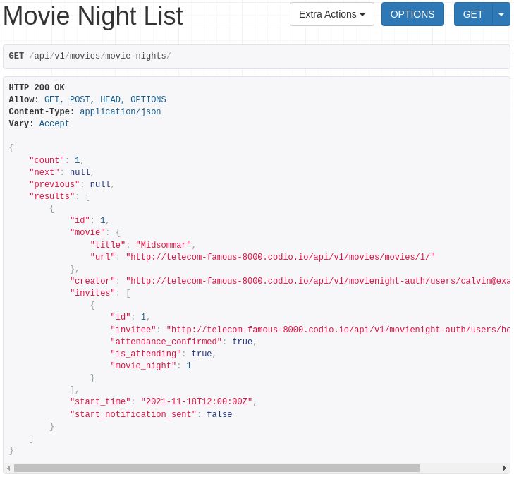
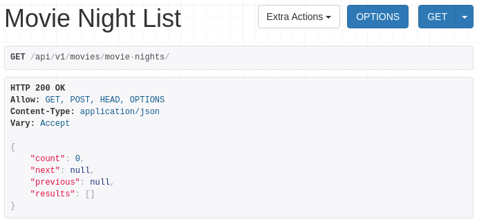

# Capstone Part 2: Question 3

## Question 3
We want to have custom permissions on MovieNightViewSet and MovieNightInvitationViewSet, to allow changes only by the “owner” of their respective models. Each of these models stores the “owner” on different fields. For MovieNight, it’s the creator, and for MovieNightInvitation, the invitee. In movies/api/permisions.py the UserFieldPermission class has been created. It checks for permission by reading the owner from the user_field attribute of the model instance.

IsCreatorPermission and IsInviteePermission need to be completed to implement the correct user_field attribute for their respective models.

Once they’re complete, apply each to the MovieNightViewSet and MovieNightInvitationViewSet, using the permission_classes. rest_framework.permissions.IsAuthenticated should also be applied as a permission to each of these classes; remember that permission classes can be combined with the bitwise AND (&) operator.

### Expected Output
Start the dev server and create a MovieNight event. Accept the invitation with the second user.
- START DEV SERVER

- View Movie Night

Next go to the api/v1/movies/movie-nights URL to see a list of all of the MovieNight events.

- View API
If you are logged in as the same user who created the MovieNight event, you should see something like this:



If you view the same URL from the account who received the invitation, you should see something like this:





Your code should pass all of the unit tests.


## Tasks

```py
# views

from django.shortcuts import redirect
from rest_framework import viewsets, mixins
from rest_framework.decorators import action
from rest_framework.exceptions import PermissionDenied
from rest_framework.response import Response

from movies.api.serializers import (
    MovieSerializer,
    MovieNightSerializer,
    MovieNightInvitationSerializer,
    GenreSerializer,
    MovieSearchSerializer,
    MovieNightInvitationCreationSerializer,
    MovieNightCreateSerializer,
)
from movies.models import Movie, MovieNight, MovieNightInvitation, Genre
from movies.omdb_integration import fill_movie_details, search_and_save

# existing code omitted
class MovieViewSet(viewsets.ReadOnlyModelViewSet):
    queryset = Movie.objects.all()
    serializer_class = MovieSerializer

    # Question 2
    def get_object(self):
        movie = super().get_object()
        fill_movie_details(movie)
        return movie

    @action(methods=["get"], detail=False)
    def search(self, request):
        search_serializer = MovieSearchSerializer(data=request.GET)

        if not search_serializer.is_valid():
            return Response(search_serializer.errors)

        term = search_serializer.data["term"]

        search_and_save(term)

        movies = self.get_queryset().filter(title__icontains=term)

        page = self.paginate_queryset(movies)

        if page is not None:
            serializer = MovieSerializer(page, many=True, context={"request": request})
            return self.get_paginated_response(serializer.data)

        return Response(
            MovieSerializer(movies, many=True, context={"request": request}).data
        )


class MovieNightViewSet(viewsets.ModelViewSet):
    queryset = MovieNight.objects.all()

    # Question 2
    def get_serializer_class(self):
        if self.request.method == "POST" or self.action == "create":
            return MovieNightCreateSerializer

        return MovieNightSerializer


    def get_object(self):
        movie_night = super(MovieNightViewSet, self).get_object()
        if (
            movie_night.creator != self.request.user
            and movie_night.invites.filter(invitee=self.request.user).count() == 0
        ):
            raise PermissionDenied()
        return movie_night

    def get_queryset(self):
        if self.action == "list":
            return self.queryset.filter(creator=self.request.user)
        return super(MovieNightViewSet, self).get_queryset()

    def perform_create(self, serializer):
        serializer.save(creator=self.request.user)

    @action(detail=False)
    def invited(self, request):
        movie_nights = MovieNight.objects.filter(
            invites__in=MovieNightInvitation.objects.filter(invitee=request.user)
        )

        page = self.paginate_queryset(movie_nights)

        if page is not None:
            serializer = MovieNightSerializer(
                page, many=True, context={"request": request}
            )
            return self.get_paginated_response(serializer.data)

        return Response(
            MovieNightSerializer(
                movie_nights, many=True, context={"request": request}
            ).data
        )

    @action(methods=["post"], detail=True)
    def invite(self, request, pk):
        movie_night = self.get_object()
        if movie_night.creator != self.request.user:
            raise PermissionDenied()

        serializer = MovieNightInvitationCreationSerializer(
            movie_night, data=request.data, context={"request": request}
        )

        if not serializer.is_valid():
            return Response(serializer.errors)

        serializer.save()
        return redirect("movienight-detail", (movie_night.pk,))


class MovieNightInvitationViewSet(
    mixins.RetrieveModelMixin,
    mixins.UpdateModelMixin,
    mixins.DestroyModelMixin,
    mixins.ListModelMixin,
    viewsets.GenericViewSet,
):
    serializer_class = MovieNightInvitationSerializer

    def get_queryset(self):
        return MovieNightInvitation.objects.filter(invitee=self.request.user)


class GenreViewSet(viewsets.ModelViewSet):
    queryset = Genre.objects.all()
    serializer_class = GenreSerializer
```

```py
# permissions

from rest_framework import permissions


class UserFieldPermission(permissions.BasePermission):
    user_field = None

    def has_object_permission(self, request, view, obj):
        if request.method in permissions.SAFE_METHODS:
            return True

        # Get the "owner" of the object from the user_field
        return getattr(obj, self.user_field) == request.user


class IsCreatorPermission(UserFieldPermission):
    pass


class IsInviteePermission(UserFieldPermission):
    pass
```

## Solution

```py
# views.py

# other import statements omitted

from rest_framework.permissions import IsAuthenticated
from movies.api import permissions

# existing code omitted

class MovieNightViewSet(viewsets.ModelViewSet):
    queryset = MovieNight.objects.all()
    permission_classes = [IsAuthenticated & permissions.IsCreatorPermission]

# existing code omitted

class MovieNightInvitationViewSet(
    mixins.RetrieveModelMixin,
    mixins.UpdateModelMixin,
    mixins.DestroyModelMixin,
    mixins.ListModelMixin,
    viewsets.GenericViewSet,
):
    serializer_class = MovieNightInvitationSerializer
    permission_classes = [IsAuthenticated & permissions.IsInviteePermission]
```
- Import IsAuthenticated and the permissions modules.
- For the MovieNightViewSet, set the permissions to logged-in users and users who created the event.
- For the MovieNightInvitationViewSet, set the permissions to logged-in users and users who were invited to the event.


```py
# permissions

# existing code omitted

class IsCreatorPermission(UserFieldPermission):
    user_field = "creator"


class IsInviteePermission(UserFieldPermission):
    user_field = "invitee"

```
- Add user_field attributes to IsCreatorPermission and IsInviteePermission.


