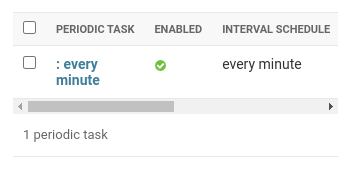

# Capstone Part 2: Question 5

## Question 5
Users will want to be notified when MovieNights are going to start. The notify_of_starting_soon() task does this, but it needs to be run every minute automatically.

Start by making changes to INSTALLED_APPS to configure Celery Beat to work with the Django database. Be sure to run the migrate command afterwards.
- MIGRATE

In movies/schedule_setup.py there is a function called schedule_setup() which will be called to set up the schedule. In this function, a PeriodicTask which executes the notify_of_starting_soon() task should be set up on a one-minute interval.

### Expected Output
A management command called schedule_setup has been created, which you can run to execute the schedule_setup() function.

- RUN SCHEDULE_SETUP SCRIPT
You can then check the Django admin to make sure it’s as you expect.
- START DEV SERVER

- View Django Admin
There should be a periodic task that runs every minute.



After it’s set up, create a MovieNight event that starts in the next 30 minutes. Accept the invitation. You can start a Celery worker and Celery beat process in different terminals to check that it’s working.

### Celery Beat
To open a second terminal, click Tools in the Codio menu bar. Then click Terminal. Change directories to movienight.
```sh
cd movie-night/module4/movienight
```

Then enter the following command in the terminal to launch the beat process.
```sh
celery -A movienight beat -l INFO --scheduler django_celery_beat.schedulers:DatabaseScheduler
```

In the Celery beat terminal you should see the notify_of_starting_soon task being scheduled.


- Click here to see a larger version of the image


### Celery Worker
Open another terminal by clicking Tools in the Codio menu bar. Then click Terminal. Change directories to movienight.
```sh
cd movie-night/module4/movienight
```

Then enter the following command in the terminal to launch the worker process.
```sh
celery -A movienight worker -l DEBUG
```

In the Celery worker terminal you should see the notify_of_starting_soon task being executed every minute. If you create a MovieNight due to start in the next 30 minutes, you should see invitations being “sent” in the Celery terminal too. Note, all times are in UTC. That means you need to calculate the difference between your current timezone and UTC when scheduling the event. You can edit the settings.py file to change the timezone of the MovieNight app. Open another terminal and run the following command to get a list of all of the timezones.
```sh
python3 -c "import pytz; print('\n'.join(pytz.all_timezones))"
```

You should see output similar to this if your tasks are running as expected:


Click here to see a larger version of the image
Your code should pass all of the unit tests.
CHECK YOUR WORK
Submit your code for evaluation.

Check It! (1 left)


## Tasks

```py
# settings.py
from datetime import timedelta
from pathlib import Path
import os
from configurations import Configuration, values

class Dev(Configuration):
    # Build paths inside the project like this: BASE_DIR / 'subdir'.
    BASE_DIR = Path(__file__).resolve().parent.parent

    # Quick-start development settings - unsuitable for production
    # See https://docs.djangoproject.com/en/3.2/howto/deployment/checklist/

    # SECURITY WARNING: keep the secret key used in production secret!
    SECRET_KEY = "django-insecure-p5+$5*@#^f3t#1274_h^ro0jnjtfpncj^(mikp#9&eh^u^v4lw"

    # SECURITY WARNING: don't run with debug turned on in production!
    DEBUG = True

    ALLOWED_HOSTS = ["localhost", "0.0.0.0", ".codio.io", os.environ.get('CODIO_HOSTNAME') + '-8000.codio.io']
    X_FRAME_OPTIONS = 'ALLOW-FROM ' + os.environ.get('CODIO_HOSTNAME') + '-8000.codio.io'
    CSRF_COOKIE_SAMESITE = None
    CSRF_TRUSTED_ORIGINS = [os.environ.get('CODIO_HOSTNAME') + '-8000.codio.io']
    CSRF_COOKIE_SECURE = True
    SESSION_COOKIE_SECURE = True
    CSRF_COOKIE_SAMESITE = 'None'
    SESSION_COOKIE_SAMESITE = 'None'

    # Application definition

    INSTALLED_APPS = [
        "movienight_auth",
        "django.contrib.admin",
        "django.contrib.auth",
        "django.contrib.contenttypes",
        "django.contrib.sessions",
        "django.contrib.messages",
        "django.contrib.staticfiles",
        "django_registration",
        "crispy_forms",
        "crispy_bootstrap5",
        "movies",
        # question 4
        "django_celery_results",
        "rest_framework",
        "rest_framework.authtoken",
    ]

    MIDDLEWARE = [
        "django.middleware.security.SecurityMiddleware",
        "django.contrib.sessions.middleware.SessionMiddleware",
        "django.middleware.common.CommonMiddleware",
        # "django.middleware.csrf.CsrfViewMiddleware",
        "django.contrib.auth.middleware.AuthenticationMiddleware",
        "django.contrib.messages.middleware.MessageMiddleware",
        # "django.middleware.clickjacking.XFrameOptionsMiddleware",
    ]

    ROOT_URLCONF = "movienight.urls"

    TEMPLATES = [
        {
            "BACKEND": "django.template.backends.django.DjangoTemplates",
            "DIRS": [BASE_DIR / "templates"],
            "APP_DIRS": True,
            "OPTIONS": {
                "context_processors": [
                    "django.template.context_processors.debug",
                    "django.template.context_processors.request",
                    "django.contrib.auth.context_processors.auth",
                    "django.contrib.messages.context_processors.messages",
                ],
            },
        },
    ]

    WSGI_APPLICATION = "movienight.wsgi.application"

    # Database
    # https://docs.djangoproject.com/en/3.2/ref/settings/#databases

    DATABASES = {
        "default": {
            "ENGINE": "django.db.backends.sqlite3",
            "NAME": BASE_DIR / "db.sqlite3",
        }
    }

    # Password validation
    # https://docs.djangoproject.com/en/3.2/ref/settings/#auth-password-validators

    AUTH_PASSWORD_VALIDATORS = [
        {
            "NAME": "django.contrib.auth.password_validation.UserAttributeSimilarityValidator",
        },
        {
            "NAME": "django.contrib.auth.password_validation.MinimumLengthValidator",
        },
        {
            "NAME": "django.contrib.auth.password_validation.CommonPasswordValidator",
        },
        {
            "NAME": "django.contrib.auth.password_validation.NumericPasswordValidator",
        },
    ]

    # Internationalization
    # https://docs.djangoproject.com/en/3.2/topics/i18n/

    LANGUAGE_CODE = "en-us"

    TIME_ZONE = values.Value("UTC")

    USE_I18N = True

    USE_L10N = True

    USE_TZ = True

    # Static files (CSS, JavaScript, Images)
    # https://docs.djangoproject.com/en/3.2/howto/static-files/

    STATIC_URL = "/static/"

    # Default primary key field type
    # https://docs.djangoproject.com/en/3.2/ref/settings/#default-auto-field

    DEFAULT_AUTO_FIELD = "django.db.models.BigAutoField"

    AUTH_USER_MODEL = "movienight_auth.User"

    CRISPY_ALLOWED_TEMPLATE_PACKS = "bootstrap5"
    CRISPY_TEMPLATE_PACK = "bootstrap5"

    EMAIL_BACKEND = "django.core.mail.backends.console.EmailBackend"

    ACCOUNT_ACTIVATION_DAYS = 7

    BASE_URL = "http://localhost:8000/"

    LOGGING = {
        "version": 1,
        "disable_existing_loggers": False,
        "formatters": {
            "verbose": {
                "format": "{levelname} {asctime} {module} {process:d} {thread:d} {message}",
                "style": "{",
            },
        },
        "handlers": {
            "console": {
                "class": "logging.StreamHandler",
                "stream": "ext://sys.stdout",
                "formatter": "verbose",
            }
        },
        "root": {
            "handlers": ["console"],
            "level": "DEBUG",
        },
    }

    OMDB_KEY = values.Value()

    SIMPLE_JWT = {
        "ACCESS_TOKEN_LIFETIME": timedelta(days=1),
        "REFRESH_TOKEN_LIFETIME": timedelta(days=7),
    }

    # existing code omitted
    # Question 2
    REST_FRAMEWORK = {
        "DEFAULT_PERMISSION_CLASSES": [
            "rest_framework.permissions.IsAuthenticated",
        ],
        "DEFAULT_AUTHENTICATION_CLASSES": [
            "rest_framework.authentication.BasicAuthentication",
            "rest_framework.authentication.SessionAuthentication",
            "rest_framework.authentication.TokenAuthentication",
            "rest_framework_simplejwt.authentication.JWTAuthentication",
        ],
        "DEFAULT_PAGINATION_CLASS": "rest_framework.pagination.PageNumberPagination",
        "PAGE_SIZE": 100,
    }

    #Question 4
    CELERY_RESULT_BACKEND = "django-db"
    CELERY_BROKER_URL = "redis://localhost:6379/0"

```


## Solution

```py
# settings.py

# existing code omitted

    INSTALLED_APPS = [
        "movienight_auth",
        "django.contrib.admin",
        "django.contrib.auth",
        "django.contrib.contenttypes",
        "django.contrib.sessions",
        "django.contrib.messages",
        "django.contrib.staticfiles",
        "django_registration",
        "crispy_forms",
        "crispy_bootstrap5",
        "movies",
        "django_celery_results",
        # Questio 5
        "django_celery_beat",
        "rest_framework",
        "rest_framework.authtoken",
    ]

# existing code omitted
```
- Add django_celery_beat to the list of installed apps.


```py
# schedule_setup.py

from django_celery_beat.models import IntervalSchedule, PeriodicTask


def schedule_setup():
    interval_schedule = IntervalSchedule.objects.create(
        every=1, period=IntervalSchedule.MINUTES
    )

    PeriodicTask.objects.create(
        task="movies.tasks.notify_of_starting_soon", interval=interval_schedule
    )
```

- Import IntervalSchedule and PeriodicTask.
- Setup an interval schedule that runs every minute.
- Create the periodic task that calls notify_of_starting_soon according to the aforementioned interval schedule.