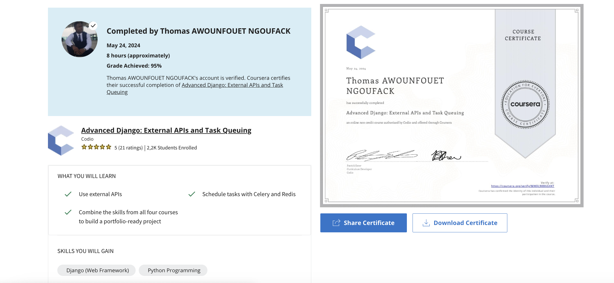

# Advanced Django: Mastering Django and Django Rest Framework Specialization

Mastering Django and the Django Rest Framework. Create a blog and an accompanying API using industry-standard tools and software packages without installing anything!

In these four courses, I learned everything from the architecting of large web development projects, to the Django REST framework, to task queuing. These topics prepare me to create  advanced websites that integrate with popular APIs and popular JavaScript frameworks, giving me enough understanding of Django to tackle more specialized projects.

## Applied Learning Project

Learners will 
- Created and optimized a blog web application using Django 
- Create a RESTful API for the blog, making use of the DRF. 
  

## Course Breakdown

### Advanced Django: Building a Blog
- Create custom filters and templates
- Optimize performance through caching and optimizing database operations
- Authenticate users with Google

### Advanced Django: Introduction to Django Rest Framework
- Build an API with Django Rest Framework
- Use Postman to explore the API
- Add functionality with serializers, viewsets, routers, authentication, and permissions

### Advanced Django: Advanced Django Rest Framework
- Optimize the Django Rest Framework
- Writing tests for the API
- Integrate with ReactJS

### Advanced Django: External APIs and Task Queuing
- Schedule tasks with Celery and Redis
- Combine the skills from all four courses to build a portfolio-ready project

### Skills i have gained 
- Django (Web Framework)
- Python Programming
- React (Web Framework)
- JavaScript

`verif link` : https://www.coursera.org/account/accomplishments/verify/MHQL98B6GKKT 
